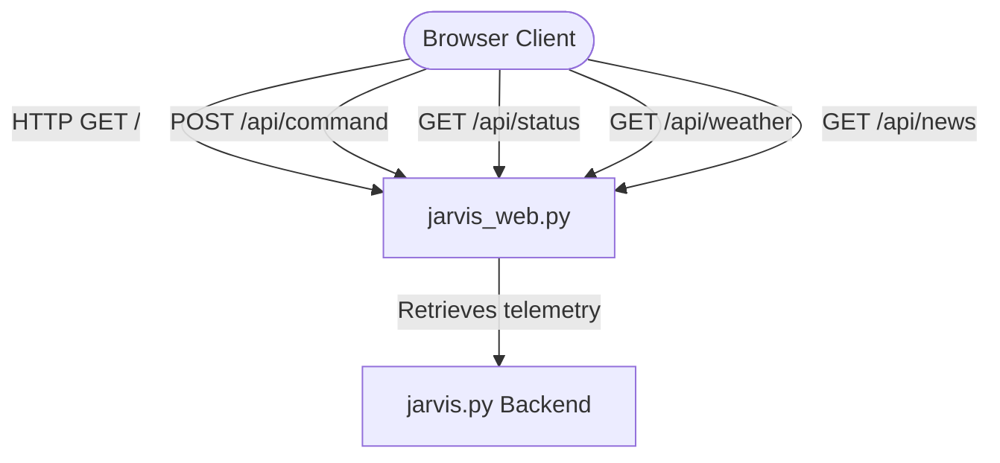

# J.A.R.V.I.S Next-Generation Web HUD GUI

This plan outlines the architecture, layout, aesthetics, and implementation details for upgrading J.A.R.V.I.S's desktop GUI to a modern, browser-based, interactive tactical HUD interface. The interface will run locally through `jarvis_web.py` and display high-fidelity sci-fi animations, live audio telemetry, and control capabilities.

---

## User Review Required

> [!IMPORTANT]
> The GUI is designed to run in a web browser (desktop, tablet, or mobile phone) on the local network. 
> To achieve 60 FPS visual performance, glowing effects, and sound synthesizer cues without lagging the core AI loops, we are leveraging native browser capabilities (HTML5 Canvas, Web Audio API, Web Speech API) and connecting them to your Python J.A.R.V.I.S engine via REST API endpoints.

> [!NOTE]
> We will update `jarvis_web.py` to add new REST endpoints `/api/weather` and `/api/news` to serve cached weather conditions and headlines to the frontend interface.

---

## Proposed Changes

We will organize the changes into two main sections: updating the Python web bridge server, and designing the frontend static assets.

### 1. Python Server Integration

#### [MODIFY] [jarvis_web.py](file:///c:/Users/PRASHANT/OneDrive/Desktop/J.A.R.V.I.S/jarvis_web.py)
* Add `/api/weather` and `/api/news` endpoints to return the current weather module values and news headlines without slowing down the fast-polling `/api/status` route.
* Update header options to ensure CORS and authentication are fully handled.

---

### 2. Frontend GUI Assets

All files will be placed inside the existing empty [web](file:///c:/Users/PRASHANT/OneDrive/Desktop/J.A.R.V.I.S/web) directory.

#### [NEW] [index.html](file:///c:/Users/PRASHANT/OneDrive/Desktop/J.A.R.V.I.S/web/index.html)
* Provides the structured semantic HTML5 layouts.
* Implements a grid of glassmorphic panels:
  - **Header**: HUD Title, biometric security clearance status, real-time clock, local weather/temperature banner, connection latency meter.
  - **Left Panel (Telemetry)**: Canvas CPU and RAM real-time history charts, disk usage indicator, network active port monitors.
  - **Center Panel (Interactive Core)**: Central interactive Canvas-based holographic J.A.R.V.I.S orb, prompter/terminal logger, microphone recording status.
  - **Right Panel (Status Feed)**: Historical transcript log (collapsible), live activity timeline feed, news headlines ticker.
* Implements a lock/passcode overlay with key-click sounds and authorization logic.

#### [NEW] [style.css](file:///c:/Users/PRASHANT/OneDrive/Desktop/J.A.R.V.I.S/web/style.css)
* Implements a sleek dark aesthetic (`#020406` background, translucent `#060d15cc` panels) using HSL color tokens for glowing neon cyan, gold, green, and red.
* Implements glassmorphism (`backdrop-filter: blur(10px)` with double cyan/gold card borders).
* Standardizes futuristic typography (importing Orbitron, Exo 2, and JetBrains Mono from Google Fonts).
* Incorporates CSS keyframe micro-animations: pulsing glow rings, horizontal laser scanning lines, terminal print effects, and hover transitions.

#### [NEW] [app.js](file:///c:/Users/PRASHANT/OneDrive/Desktop/J.A.R.V.I.S/web/app.js)
* **Visual Core Animation**: Implements the Canvas J.A.R.V.I.S orb with nested rotating arcs, radial energy waves, and satellite labels that react dynamically to system states (`STANDBY` = cyan, `LISTENING` = green, `THINKING` = purple swirl, `SPEAKING` = gold pulse).
* **Audio Synthesizer Cues**: Generates futuristic, mechanical click and alert sounds using the browser's Web Audio API (`OscillatorNode`), removing the need for local sound assets.
* **Microphone Visualizer**: Visualizes real-time microphone capture waveforms on the HUD screen during voice commands.
* **REST Uplink Client**: Manages polling of `/api/status`, `/api/weather`, and `/api/news` to update telemetry charts, feeds, and headlines.

---

## Verification Plan

### Automated/Local Execution Tests
1. Verify python script syntax:
   `python -m py_compile jarvis_web.py`
2. Start the local server:
   `python jarvis_web.py --host 127.0.0.1 --port 8765`
3. Launch the browser and open `http://localhost:8765` to verify:
   * Smooth 60 FPS central orb rotation.
   * Lock screen authorization using passcode `0A0W8E4P7X6N9X1U3`.
   * Web Audio click sounds are audible on UI hovers and authorization events.
   * Live telemetry updates (CPU, RAM charts) populate accurately from the server.
   * Sending commands via input prompter populates the conversational feed.

### Manual Verification
* Access the interface from a smartphone/tablet connected to the same Wi-Fi using the LAN address (e.g., `http://<lan-ip>:8765`) to verify mobile responsiveness and touch-friendly interactive gestures.
